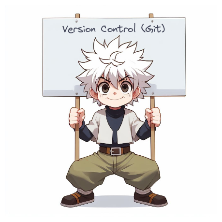

# Version-Control-Git

  
   
   <samp>
  "When Gon and Killua decided to develop 
  the program 'ta tta ttaa' 
  to hack the defense system of the Camera Ants, 
  they faced the challenge of communicating with each other 
  to contribute to the program, especially since they were working 
  in secret and might end up working alone. 
  Consequently, they decided to use Git and GitHub 
  to maintain all versions of their program and contribute smoothly." 
  </samp>  

