# Version-Control-Git
<p align="center">
  <samp>
    Please note that this repository serves as an introduction to understanding Git. For comprehensive details, you can refer to the <a href="https://git-scm.com/doc">official Git documentation</a>.
  </samp>
</p>
<p align="center">
  
  <br>
   <samp>
  "When Gon and Killua decided to develop<br>
  the program 'ta tta ttaa'<br>
  to hack the defense system of the Camera Ants,<br>
  they faced the challenge of communicating with each other<br>
  to contribute to the program, especially since they were working<br>
  in secret and might end up working alone.<br>
  Consequently, they decided to use Git and GitHub<br>
  to maintain all versions of their program and contribute smoothly."<br>
  </samp>  
</p>

### Table of content

1. [Version Control Systems (VCSs) - breif.](#desc0)
2. [Git Architecture.](#desc1)
3. [Files State in Git.](#desc2)
4. [Understanding the 3-Tree Architecture of Git.](#desc3)
5. [Undoing Changes.](#desc4)
6. [Tagging.](#desc5)
7. [Branching.](#desc6)
8. [Remotes.](#desc7)
9. [Resources.](#desc8)
10. [Mission accomplished.](#desc9)

<a name="desc0"></a>
### Version Control Systems (VCSs) - breif.

<p align="center">
  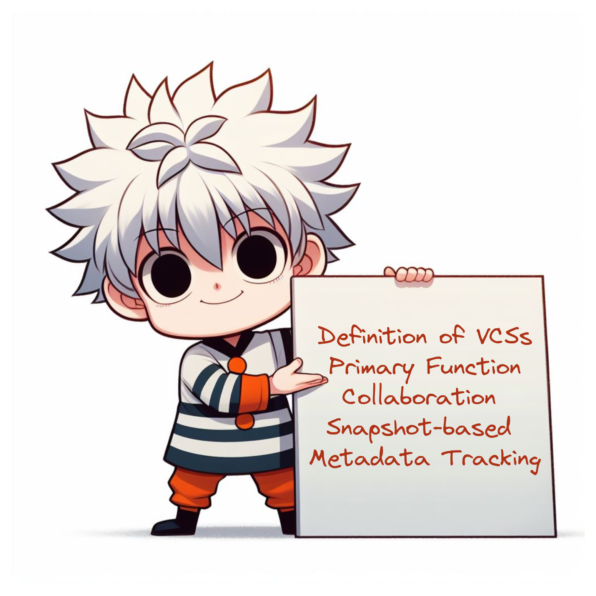
  <br>
  <P align="left">
      <samp>
  • Definition of VCSs: Tools to track changes in source code and file collections.<br>
  • Primary Function: Tracks changes, maintaining a comprehensive history of file and folder modifications.<br>
  • Collaboration Facilitation: Enables simultaneous collaboration by multiple users on the same codebase.<br>
  • Snapshot-based Tracking: Changes captured in snapshots, each representing the complete state of files and folders within the top-level directory.<br>
  • Metadata Maintenance: Stores metadata, including snapshot creators, associated messages, and relevant information.<br>
  • We'll discuss this and more within this repository.
  </samp>
  </P>
</p>

<a name="desc1"></a>
### Git Architecture.


#### Track Everything
- content
- metadate
##### To make everything tracked, we must convert everything to objects.
- An object is a ```blob```, ```tree```, or ```commit```:
- each file converted to ```blob```.
    - the ```blob``` contains: 
        - content.
        - metadate eg.(permissions, name of the file, type, size, ...).
- each folder converted to ```tree```.
    - the ```tree``` contains: 
        - content - hierarchy.
        - metadata.

- Snapshot
  - A snapshot is the  top-level tree being tracked. For example, the tree might look like this:
  <br>

  ```
  <root> (tree)
  |
  +- gon (tree)
  |  |
  |  + killua.txt (blob, contents = "Baka!")
  |
  +- killua.txt (blob, contents = "Baka gon!")
  ```
#### OS agnostic
- Runs under any operating system.
- To make it runs under an operating system:
  - Semple Folder Structure.
  - All its components are straightforward.
     - most of it, sample files.
   - Portable folder run across any operating system.
     - It will be created inside your working tree as a hidden folder (.git).

#### Unique ID
- Each object tracked must have a unique ID.
- using any hash function, but it must be deterministic.
    - which, when given a certain input, produces the same output each time.
    - eg. shasum function in linux, SHA-1, MD-5.
    <br>

  ```
    gon@killua:~$ echo "killua" | shasum
    a9080963645c21a1507822e0298b5bd4867d022c  -
    gon@killua:~$ echo "killua" | shasum
    a9080963645c21a1507822e0298b5bd4867d022c  -
    gon@killua:~$ echo "gon" | shasum
    251da38c857f39611d2a999d89b7b695583a7ece  -
    gon@killua:~$ echo "gon" | shasum
    251da38c857f39611d2a999d89b7b695583a7ece  -
  ```
<P align="center">
  <samp>
    You can see that: when given a certain input, produces the same output each time.
  </samp>
</P>

- Git uses ```git hash-object```, which is equivalent to ```shasum``` in Linux.
- but there some issue, let see that:
  
  ```
  gon@killua:~$ echo "baka gon" | git hash-object --stdin
  6bec9a5fa940e76212a8a224301ac83a3a5452d2
  gon@killua:~$ echo "baka gon" | shasum
  a9cff0296509ebac8f8441ab19c3c316cb0407d4  -
  ```
<P align="center">
  <samp>
    Yes, good observation. The output is different even though both use SHA-1.
  </samp>
</P>


- that because git adds some information to the input as follows:
   - type
   - size
   - Null character
- so "baka gon" converted to:
  - ```type``` +  ```size``` + ```\0``` + ```content``` :
  - "blob 9\0baka gon"
      - Size: 9, which is the number of characters in ```baka gon``` + 1 hidden line break.
  <br>
  
  ```
  gon@killua:~$ echo "baka gon" | git hash-object --stdin
  6bec9a5fa940e76212a8a224301ac83a3a5452d2
  gon@killua:~$ echo -e "blob 9\0baka gon" | shasum
  6bec9a5fa940e76212a8a224301ac83a3a5452d2  -
  ```
  - Note that the ```-e``` option is used to recognize ```\0``` as an escape character.

#### Track the history
- By utilizing SHA-1 for the object, if there's any change in a file or directory, Git compares the new SHA-1 with the current one saved in the ```.git``` file.
- Git recognizes the change and takes appropriate actions, as we will see later on.


<a name="desc2"></a>
### Files State in Git.
- Untracked(U).
- Tracked.
    - ```Modified(M)```: The version in the git repois different from the versionin the working directory.
    - ```UNmodified```: The version in the git repo is equivalent to the version in the working directory.
 
<a name="desc3"></a>
### Understanding the 3-Tree Architecture of Git.
#### overview
- Working Directory or (Working tree).
- Staging Area (Index)
- git repo ```.git```.
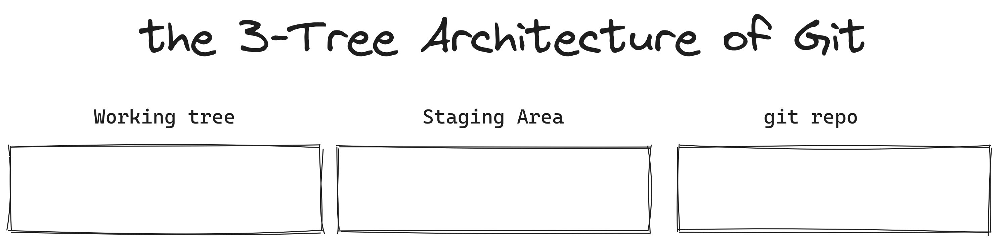

#### The normal pipeline to take the snapshot.

- first of all
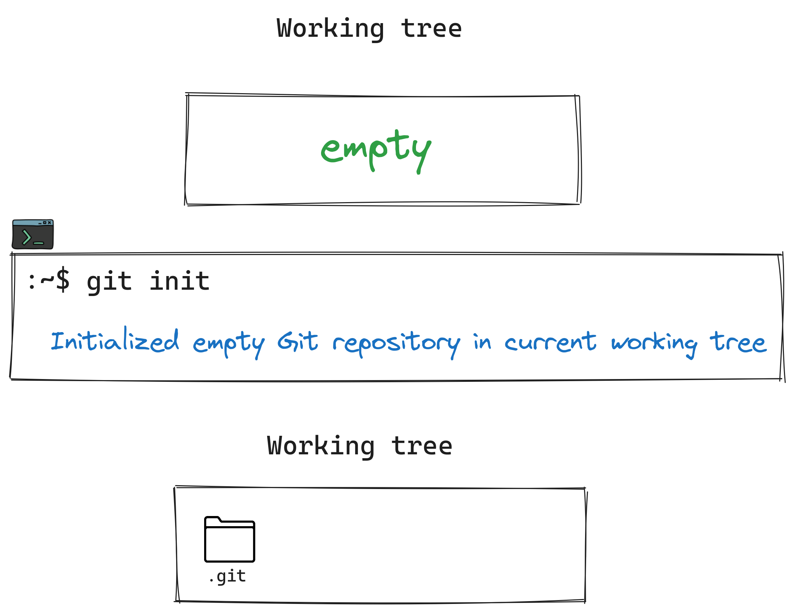

- There is nothing added to the working tree yet; let's add a text file.
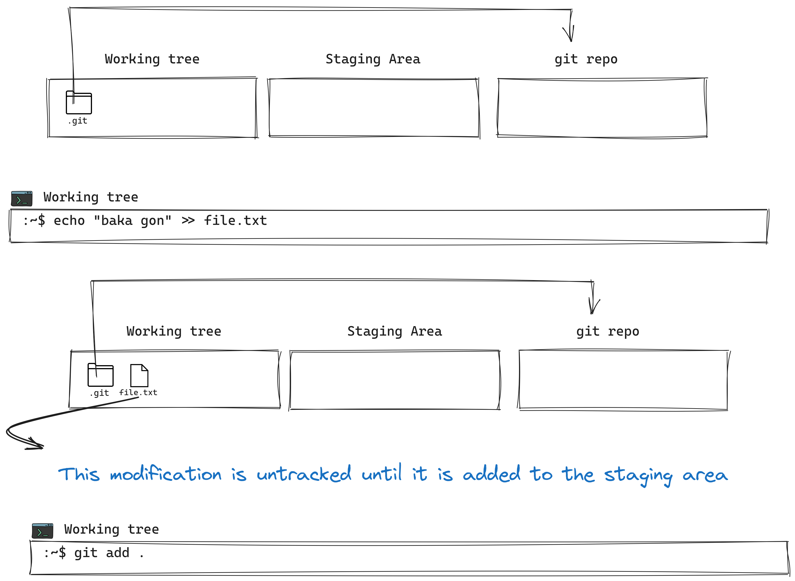

- Once you add it to the staging area, it becomes a tracked file
     - The SHA of this modification recorded in the staging area.
     - And git will initialize a new object for this modification in the git repo with the same SHA-1.
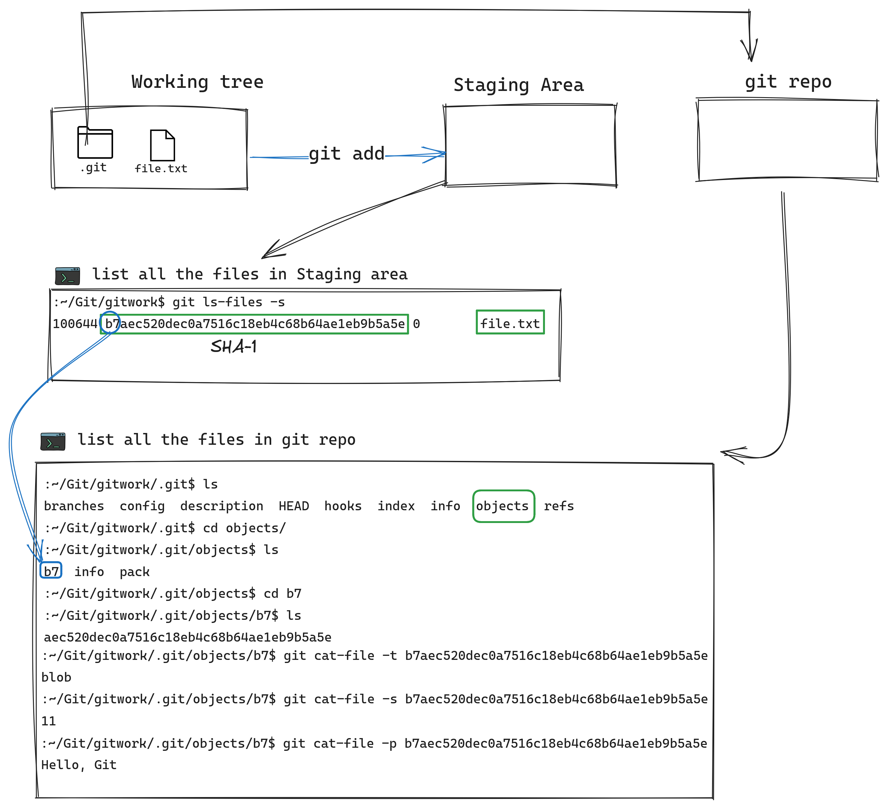

- observation
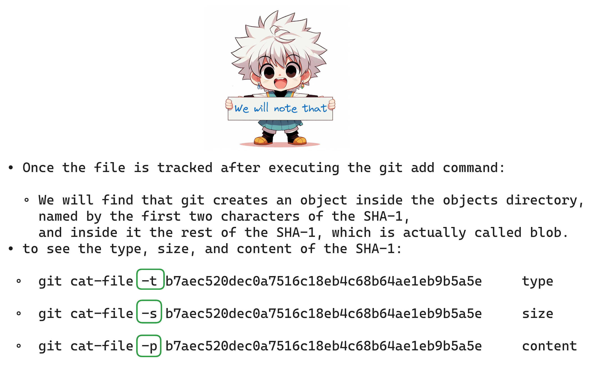

- Once you use the commit command, there is the first version inside the Git repository.
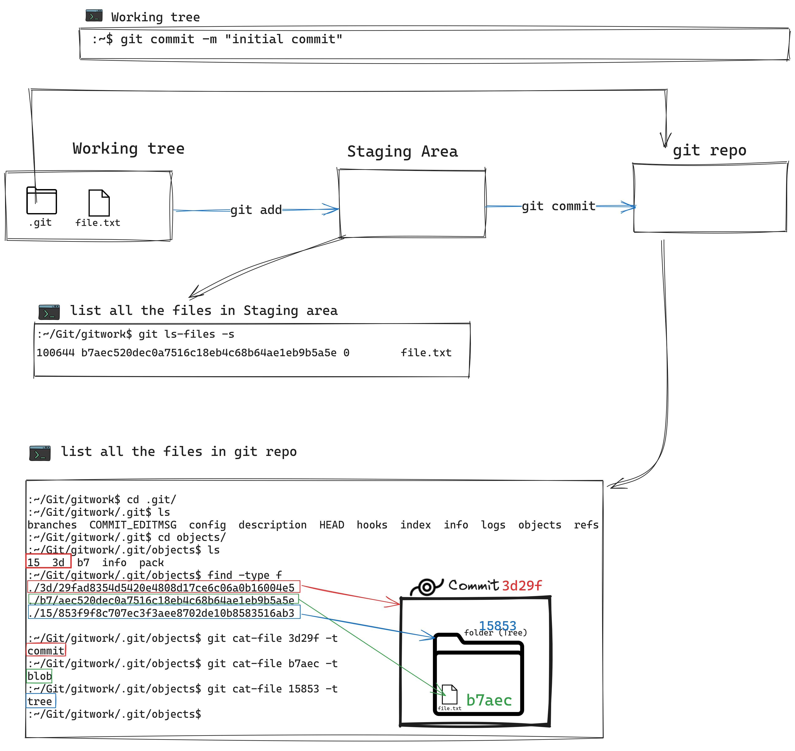
<p align="center">
  <samp>  We noticed that, to track any batch of modifications, we have to use the commit object.</samp>
</p>

- So let's summarize everything.
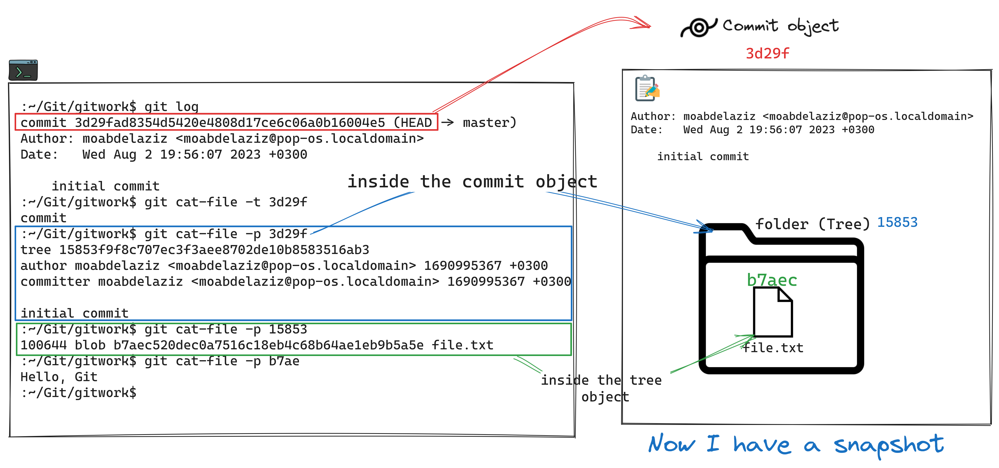

- Now, let's create another commit and check the logs to observe something new.
  ```
  gon@killua:~/safrot$ git commit -m "Added: killua quote"
  [master 2e173f5] Added: killua quote
    1 file changed, 2 insertions(+)
  gon@killua:~/safrot$ git log
  commit 2e173f54760acec95aa13e9528bb051297086346 (HEAD -> master)
  Author: killua-zoldyck <killua.zoldyck@hunter.com>
  Date:   Sat Dec 16 16:31:10 2023 +0200

    Added: killua quote

  commit 0831b2abdf87c45490927bbe67987bf54a13fe05
  Author: killua-zoldyck <killua.zoldyck@hunter.com>
  Date:   Sat Dec 16 10:19:25 2023 +0200

    initial commit
  gon@killua:~/safrot$ git cat-file -p 2e173
  tree 095a5a3702c66d4f07cd4eb89e4db0fe58f9518b
  parent 0831b2abdf87c45490927bbe67987bf54a13fe05
  author killua-zoldyck <killua.zoldyck@hunter.com> 1702737070 +0200
  committer killua-zoldyck <killua.zoldyck@hunter.com> 1702737070 +0200

  Added: killua quote
  ```
    - When inspecting the contents of the second commit to see the objects inside, you will notice the new object called parent.
        - ```parent 0831b2abdf87c45490927bbe67987bf54a13fe05```
        - This ```parent``` object indicates the previous commit.
        - let's inspect the ```parent``` object to prove that:

          ```
          gon@killua:~/safrot$ git cat-file -p 0831b
          tree a8b5d8e390da04fddb206c254066da178fd51f60
          author killua-zoldyck <killua.zoldyck@hunter.com> 1702714765 +0200
          committer killua-zoldyck <killua.zoldyck@hunter.com> 1702714765 +0200

          initial commit 
          ```
  - This leads us to a new concept in Git, which is the ```branch```.
      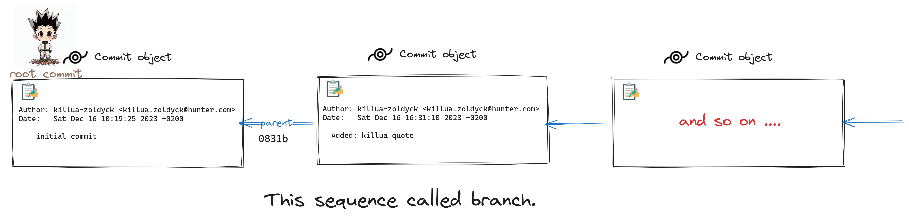


<a name="desc4"></a>
### Undoing Changes.
- To stop tracking a file in Git, you can use the ```git rm``` command with the ```--cached``` option.
  
    ```
    git rm --cached filename
    ```
    - This will commit the removal of the file from the staging area, and the file will no longer be tracked by Git. However, it will still exist in your working directory. If you want to remove the file from both the working directory and the repository, you can use ```git rm``` without the ```--cached``` option:
      
       ```
       git rm filename
       ```
       
- To restore or discard changes in your working directory, use git restore with the filename. This allows you to undo modifications to a file and revert it to the state in the last commit.
  
  ```
  git restore filename
  ```

- To unstage changes from the staging area (index) back to your working directory.

  ```
  git restore --staged filename
  ```
  - After running this command, the changes to the specified file are removed from the staging area, but the modifications remain in your working directory. If you want to discard the changes in your working directory as well, you can follow it up with:
    
       ```
      git restore filename
       ```
- To edit the last commit message in Git, you can use the ```--amend``` option with the ```git commit``` command:
  
    ```
    git commit --amend
    ```
    
- Exploring the process of rolling back and rolling forward between different versions.
     - Let's list all commits using the ```git log --oneline``` command.

       ```
       gon@killua:~/safrot$ git log --oneline 
       485f5b3 (HEAD -> master) Added: Koala quote
       fff45f7 Killua tell gon something
       2e173f5 Added: killua quote
       0831b2a initial commit
       ```
  
       - There are four commits.
       - You can observe that the HEAD points to the last commit, which is also the current working tree. This indicates that the commit the HEAD points to is the working tree.
   
       - So you can step back and move forward by moving the ```HEAD``` to the commit that you want.
         
          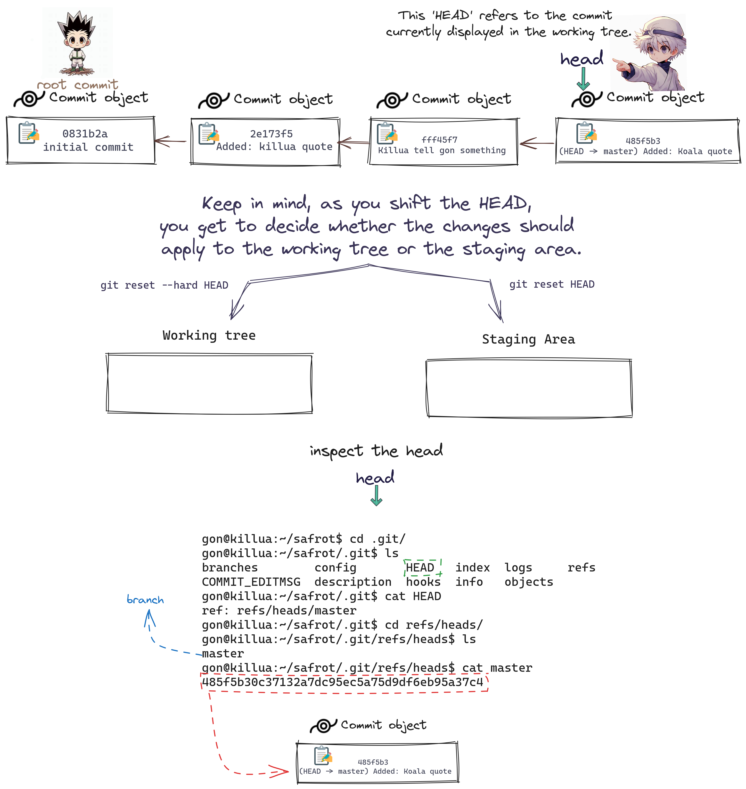
       - Explore all aspects of [```git reset```](https://git-scm.com/docs/git-reset).


<a name="desc5"></a>
### Tagging.

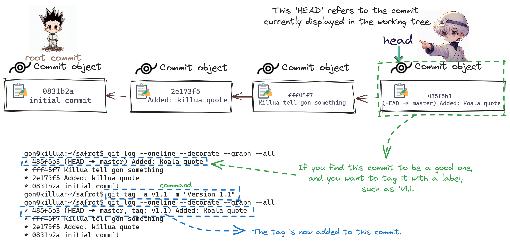

- Now you can use the tag name to show this commit: ```git show v1.1```

  ```
  gon@killua:~/safrot$ git show v1.1
  tag v1.1
  Tagger: killua-zoldyck <killua.zoldyck@hunter.com>
  Date:   Mon Dec 18 08:57:16 2023 +0200

  Version 1.1

  commit 485f5b30c37132a7dc95ec5a75d9df6eb95a37c4 (HEAD -> master, tag: v1.1)
  Author: killua-zoldyck <killua.zoldyck@hunter.com>
  Date:   Sun Dec 17 14:17:18 2023 +0200

    Added: Koala quote

  diff --git a/file.txt b/file.txt
  index 37c8c0d..60b5bfd 100644
  --- a/file.txt
  +++ b/file.txt
  @@ -1,4 +1,5 @@
   baka gon
   People Only Find Me Interesting Because They Can't Tell Whether I'm Serious Or Not.
   Gon, You Are Light. But Sometimes You Shine So Brightly, I Must Look Away. Even So, Is It Still Okay If I Stay At Your Side?
  +No Matter The Pain, I Will Keep Living. So, When I Die, I'll Feel I Did The Best I Could." – Koala
  :
  ```
  
- Explore all aspects of [```git tag```](https://git-scm.com/book/en/v2/Git-Basics-Tagging).


<a name="desc6"></a>
### Branching.

- So far, our sequence looks like this:
  
  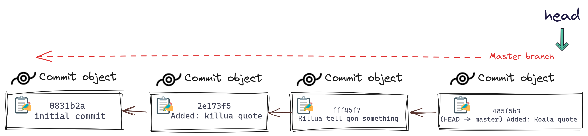
  
- Now, this is the ```master``` branch. Let's create a new branch and see what will happen:

  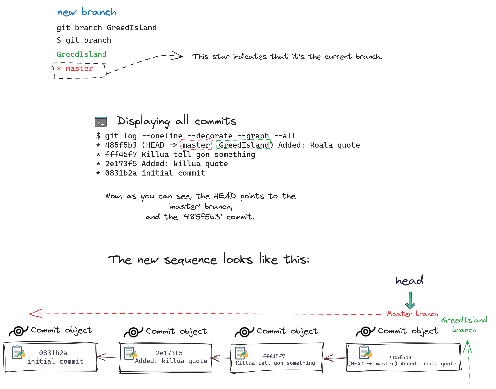

- Now if you switch to the ```GreedIsland``` branch, and the sequence will look like this:

  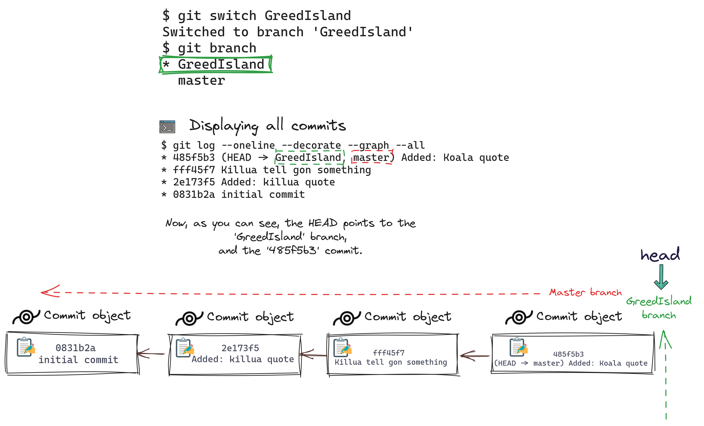

- Now let's make changes in files and commit these changes, but in the ```GreedIsland``` branch.

  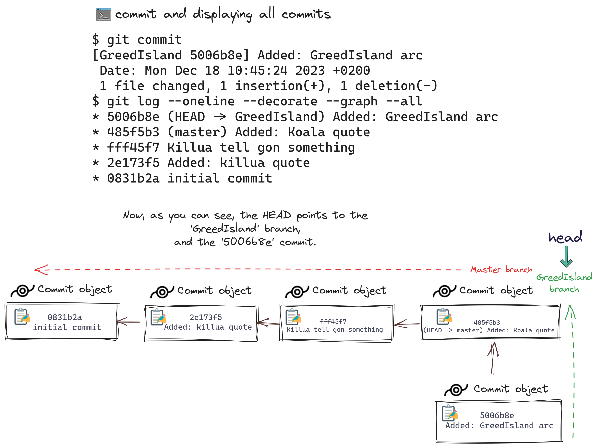

- Now, after being satisfied with this branch, and you want to merge the ```GreedIsland``` branch into ```Master```:

  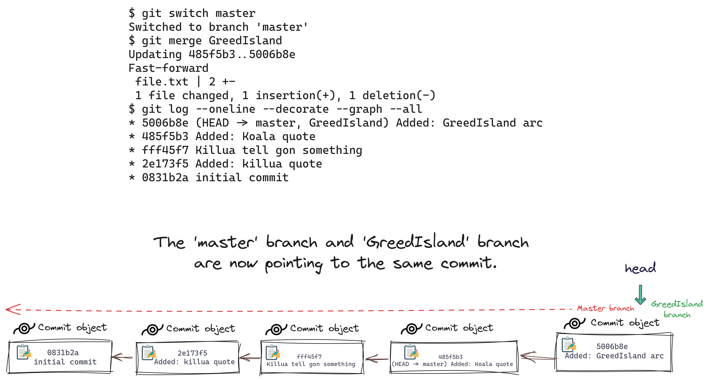

- Now you can delete the ```GreedIsland``` branch"

  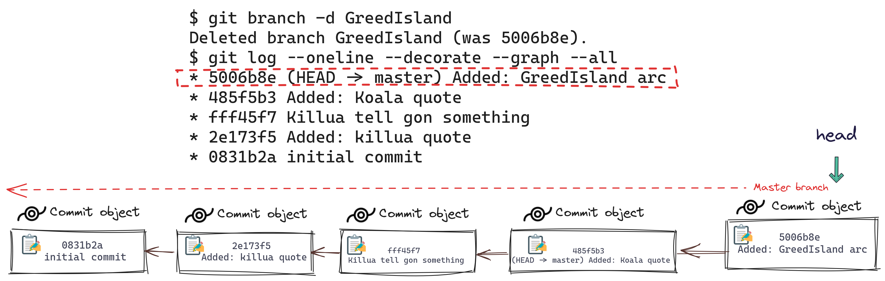

<p align="center"><samp>But note that in this case, the master branch, from the moment you create the new branch, doesn't change, and this is not common in real life.</samp></p>

##### So let's consider a case where you create a new branch, make edits in this branch, and the master branch is also edited

- Master branch

    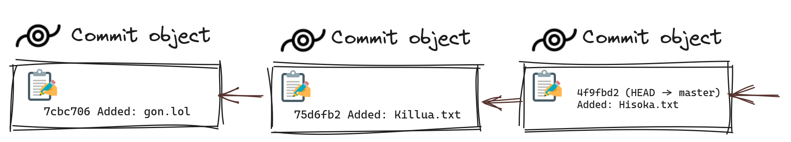
    
- Create the ```GreedIsland``` branch. ```git branch GreedIsland```

  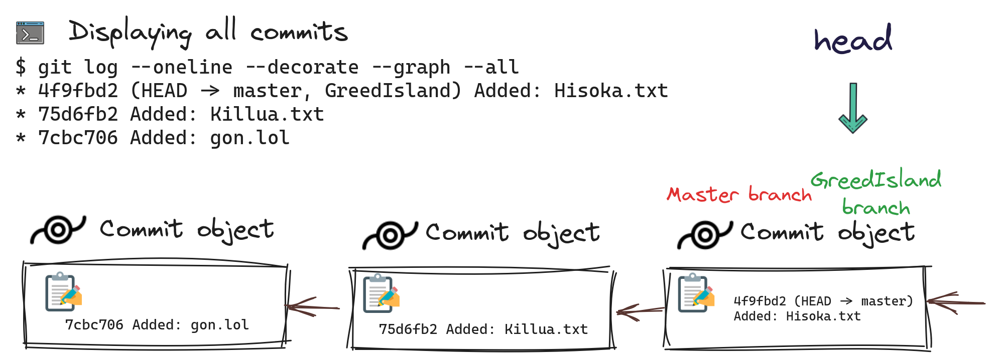

- Now switch to the 'GreedIsland' branch and make edits.

  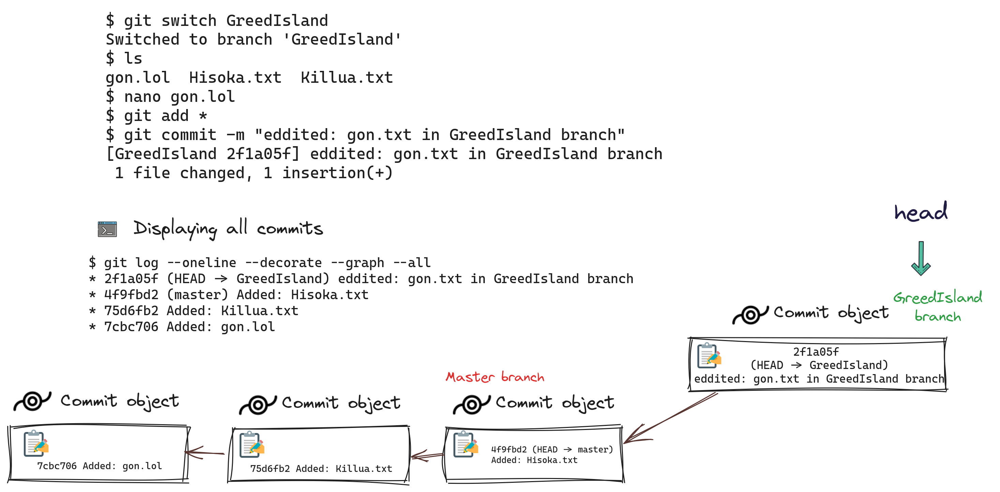

- Now switch back to the ```master``` branch and make edits.

  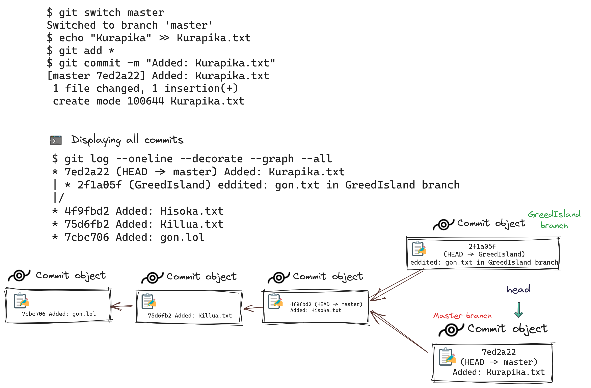

- Now merge ```GreedIsland``` into ```master```. ```git merge GreedIsland```

  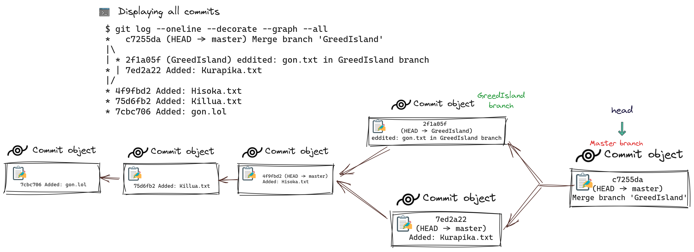

- This is a useful [reference](https://stackoverflow.com/questions/16666089/whats-the-difference-between-git-merge-and-git-rebase) to understand the difference between ```git merge``` and ```git rebase```.

<a name="desc7"></a>
### Remotes.

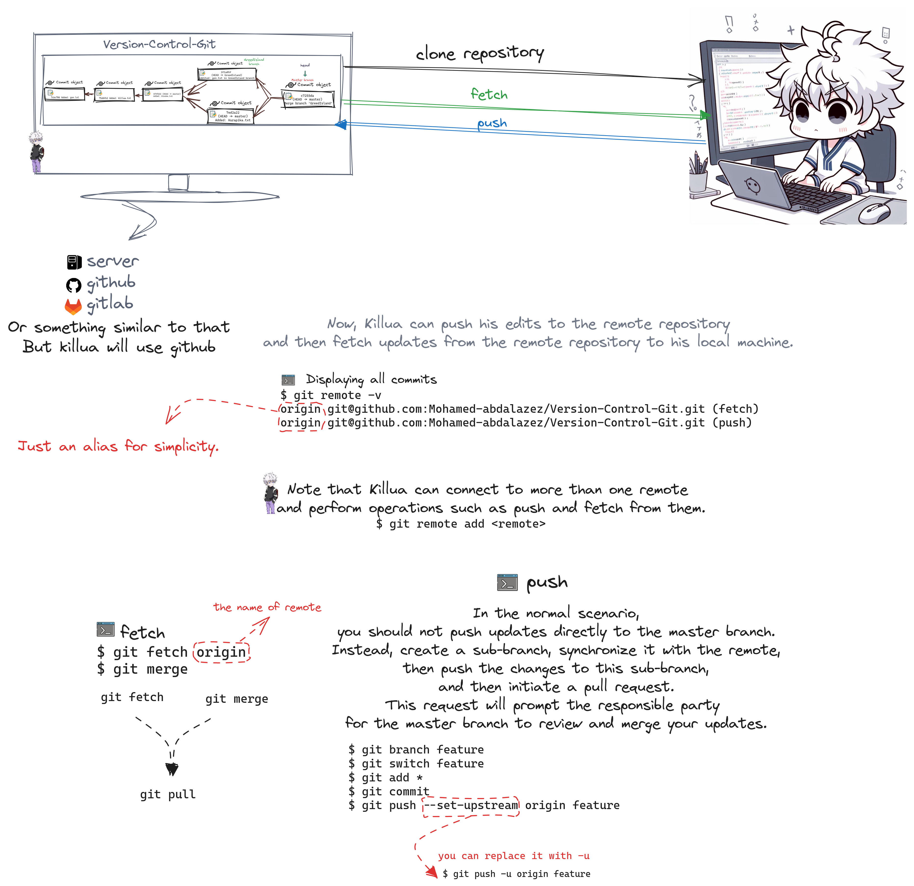

<a name="desc8"></a>
### Rescureses.
```This is an inspiring resource that I highly recommend for further exploration```
- [./missing-semester](https://missing.csail.mit.edu/2020/version-control/).
- [ArabBigDataYoutubeChannel](https://missing.csail.mit.edu/2020/version-control/).

<a name="desc9"></a>
### Mission accomplished.

<p align="center">
   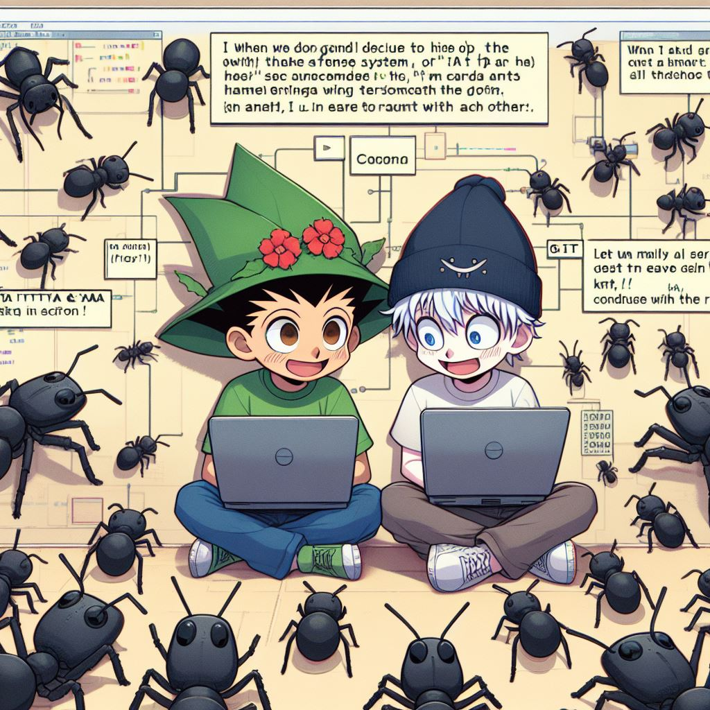
  <br>
   <samp>
  "Gon and Killua successfully reclaimed their land from the camera ants,<br>
  a victory hard-earned through numerous sacrifices and with crucial assistance from Git as well.<br>
  Following this triumph, they embarked on the task of reconstructing their land, replanting pomegranate and olive trees.<br>
  </samp>  
</p>
