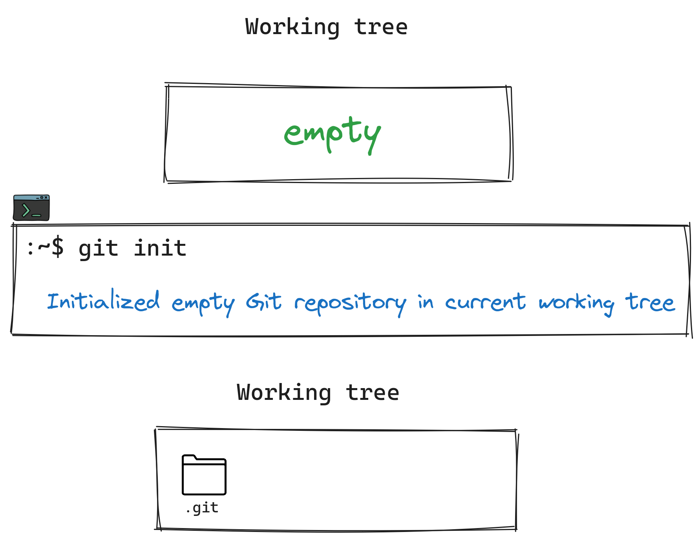
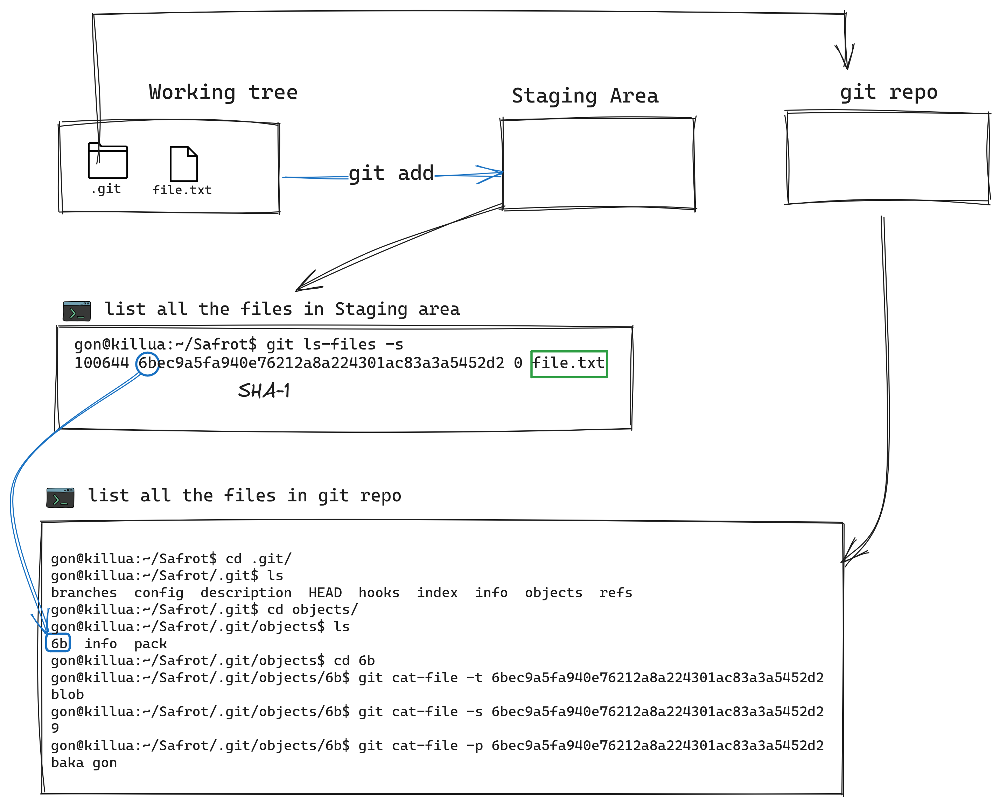
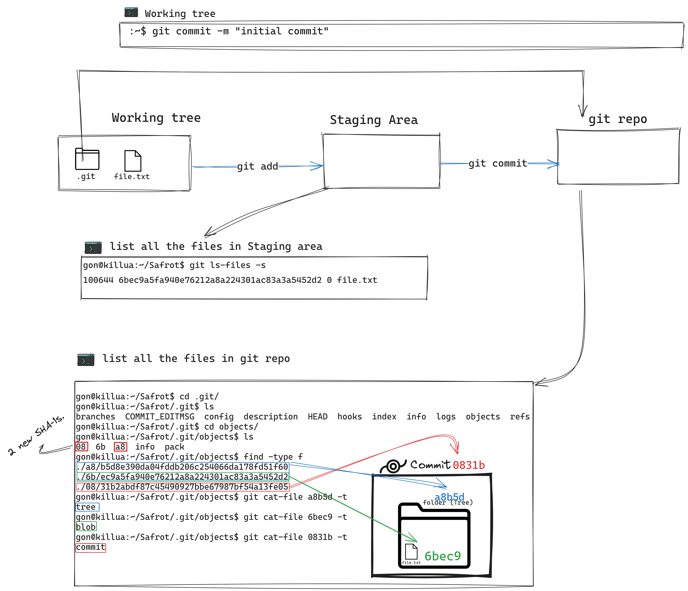
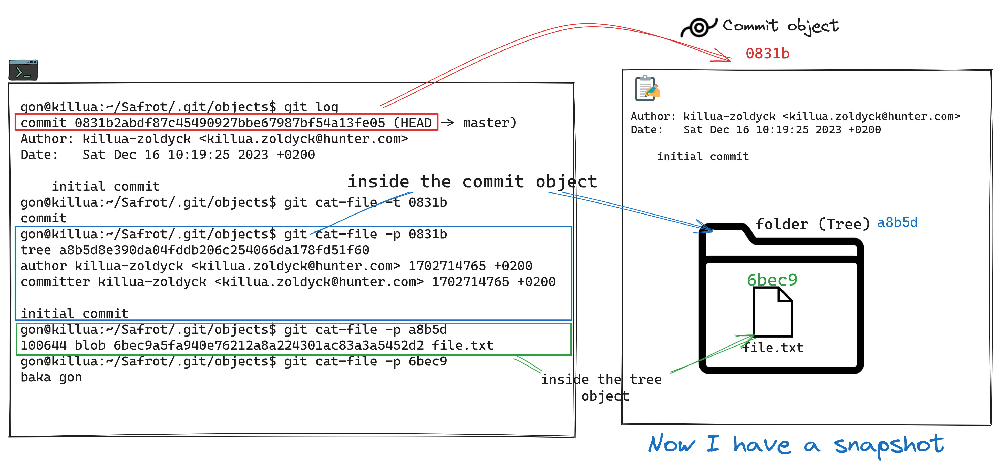
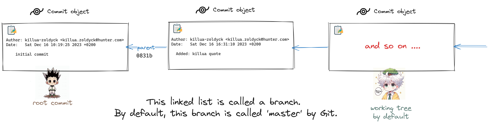

# Version-Control-Git

<p align="center">
  
  <br>
   <samp>
  "When Gon and Killua decided to develop<br>
  the program 'ta tta ttaa'<br>
  to hack the defense system of the Camera Ants,<br>
  they faced the challenge of communicating with each other<br>
  to contribute to the program, especially since they were working<br>
  in secret and might end up working alone.<br>
  Consequently, they decided to use Git and GitHub<br>
  to maintain all versions of their program and contribute smoothly."<br>
  </samp>  
</p>

### Table of content

1. [Version Control Systems (VCSs) - breif.](#desc0)
2. [Git Architecture.](#desc1)
3. [Files State in Git.](#desc2)
4. [Understanding the 3-Tree Architecture of Git.](#desc3)

<a name="desc0"></a>
### Version Control Systems (VCSs) - breif.

<p align="center">
  
  <br>
  <P align="left">
      <samp>
  • Definition of VCSs: Tools to track changes in source code and file collections.<br>
  • Primary Function: Tracks changes, maintaining a comprehensive history of file and folder modifications.<br>
  • Collaboration Facilitation: Enables simultaneous collaboration by multiple users on the same codebase.<br>
  • Snapshot-based Tracking: Changes captured in snapshots, each representing the complete state of files and folders within the top-level directory.<br>
  • Metadata Maintenance: Stores metadata, including snapshot creators, associated messages, and relevant information.<br>
  • We'll discuss this and more within this repository.
  </samp>
  </P>
</p>

<a name="desc1"></a>
### Git Architecture.


#### Track Everything
- content
- metadate
##### To make everything tracked, we must convert everything to objects.
- An object is a ```blob```, ```tree```, or ```commit```:
- each file converted to ```blob```.
    - the ```blob``` contains: 
        - content.
        - metadate eg.(permissions, name of the file, type, size, ...).
- each folder converted to ```tree```.
    - the ```tree``` contains: 
        - content - hierarchy.
        - metadata.

- Snapshot
  - A snapshot is the  top-level tree being tracked. For example, the tree might look like this:
  <br>

  ```
  <root> (tree)
  |
  +- gon (tree)
  |  |
  |  + killua.txt (blob, contents = "Baka!")
  |
  +- killua.txt (blob, contents = "Baka gon!")
  ```
#### OS agnostic
- Runs under any operating system.
- To make it runs under an operating system:
  - Semple Folder Structure.
  - All its components are straightforward.
     - most of it, sample files.
   - Portable folder run across any operating system.
     - It will be created inside your working tree as a hidden folder (.git).

#### Unique ID
- Each object tracked must have a unique ID.
- using any hash function, but it must be deterministic.
    - which, when given a certain input, produces the same output each time.
    - eg. shasum function in linux, SHA-1, MD-5.
    <br>

  ```
    gon@killua:~$ echo "killua" | shasum
    a9080963645c21a1507822e0298b5bd4867d022c  -
    gon@killua:~$ echo "killua" | shasum
    a9080963645c21a1507822e0298b5bd4867d022c  -
    gon@killua:~$ echo "gon" | shasum
    251da38c857f39611d2a999d89b7b695583a7ece  -
    gon@killua:~$ echo "gon" | shasum
    251da38c857f39611d2a999d89b7b695583a7ece  -
  ```
<P align="center">
  <samp>
    You can see that: when given a certain input, produces the same output each time.
  </samp>
</P>

- Git uses ```git hash-object```, which is equivalent to ```shasum``` in Linux.
- but there some issue, let see that:
  
  ```
  gon@killua:~$ echo "baka gon" | git hash-object --stdin
  6bec9a5fa940e76212a8a224301ac83a3a5452d2
  gon@killua:~$ echo "baka gon" | shasum
  a9cff0296509ebac8f8441ab19c3c316cb0407d4  -
  ```
<P align="center">
  <samp>
    Yes, good observation. The output is different even though both use SHA-1.
  </samp>
</P>


- that because git adds some information to the input as follows:
   - type
   - size
   - Null character
- so "baka gon" converted to:
  - ```type``` +  ```size``` + ```\0``` + ```content``` :
  - "blob 9\0baka gon"
      - Size: 9, which is the number of characters in ```baka gon``` + 1 hidden line break.
  <br>
  
  ```
  gon@killua:~$ echo "baka gon" | git hash-object --stdin
  6bec9a5fa940e76212a8a224301ac83a3a5452d2
  gon@killua:~$ echo -e "blob 9\0baka gon" | shasum
  6bec9a5fa940e76212a8a224301ac83a3a5452d2  -
  ```
  - Note that the ```-e``` option is used to recognize ```\0``` as an escape character.

#### Track the history
- By utilizing SHA-1 for the object, if there's any change in a file or directory, Git compares the new SHA-1 with the current one saved in the ```.git``` file.
- Git recognizes the change and takes appropriate actions, as we will see later on.


<a name="desc2"></a>
### Files State in Git.
- Untracked(U).
- Tracked.
    - ```Modified(M)```: The version in the git repois different from the versionin the working directory.
    - ```UNmodified```: The version in the git repo is equivalent to the version in the working directory.
 
<a name="desc3"></a>
### Understanding the 3-Tree Architecture of Git.
#### overview
- Working Directory or (Working tree).
- Staging Area (Index)
- git repo ```.git```.


#### The normal pipeline to take the snapshot.

- first of all


- There is nothing added to the working tree yet; let's add a text file.


- Once you add it to the staging area, it becomes a tracked file
     - The SHA of this modification recorded in the staging area.
     - And git will initialize a new object for this modification in the git repo with the same SHA-1.


- observation


- Once you use the commit command, there is the first version inside the Git repository.

<p align="center">
  <samp>  We noticed that, to track any batch of modifications, we have to use the commit object.</samp>
</p>

- So let's summarize everything.


- Now, let's create another commit and check the logs to observe something new.
  ```
  gon@killua:~/safrot$ git commit -m "Added: killua quote"
  [master 2e173f5] Added: killua quote
    1 file changed, 2 insertions(+)
  gon@killua:~/safrot$ git log
  commit 2e173f54760acec95aa13e9528bb051297086346 (HEAD -> master)
  Author: killua-zoldyck <killua.zoldyck@hunter.com>
  Date:   Sat Dec 16 16:31:10 2023 +0200

    Added: killua quote

  commit 0831b2abdf87c45490927bbe67987bf54a13fe05
  Author: killua-zoldyck <killua.zoldyck@hunter.com>
  Date:   Sat Dec 16 10:19:25 2023 +0200

    initial commit
  gon@killua:~/safrot$ git cat-file -p 2e173
  tree 095a5a3702c66d4f07cd4eb89e4db0fe58f9518b
  parent 0831b2abdf87c45490927bbe67987bf54a13fe05
  author killua-zoldyck <killua.zoldyck@hunter.com> 1702737070 +0200
  committer killua-zoldyck <killua.zoldyck@hunter.com> 1702737070 +0200

  Added: killua quote
  ```
    - When inspecting the contents of the second commit to see the objects inside, you will notice the new object called parent.
        - ```parent 0831b2abdf87c45490927bbe67987bf54a13fe05```
        - This ```parent``` object indicates the previous commit.
        - let's inspect the ```parent``` object to prove that:

          ```
          gon@killua:~/safrot$ git cat-file -p 0831b
          tree a8b5d8e390da04fddb206c254066da178fd51f60
          author killua-zoldyck <killua.zoldyck@hunter.com> 1702714765 +0200
          committer killua-zoldyck <killua.zoldyck@hunter.com> 1702714765 +0200

          initial commit 
          ```
  - This leads us to a new concept in Git, which is the ```branch```.
      
